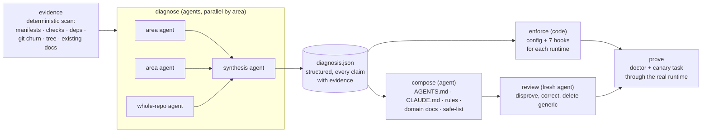

<h1 align="center">fenceline</h1>

<p align="center"><strong>Agents that read your codebase and build the environment other agents need — then hooks that make it stick.</strong><br>
One command. Your agent runtime does the diagnosis; fenceline turns what it learned into an operating manual, rules, domain docs, a safe-list and runtime-enforced guards that are specific to <em>your</em> repository.</p>

<p align="center">
  <a href="https://www.npmjs.com/package/fenceline"></a>
  <a href="https://github.com/g0007b1/fenceline/actions/workflows/ci.yml"></a>
  
  
  <a href="LICENSE"></a>
</p>

<p align="center"><code>npx fenceline init</code></p>

<p align="center">
  Drives: <b>Claude Code</b> · Cursor CLI · Codex · Gemini CLI &nbsp;|&nbsp; Configures: <b>Cursor</b> · <b>Claude Code</b> · Codex · Gemini · Copilot &nbsp;|&nbsp; Node · Python · Go · Rust · anything
</p>

## Why

Every "make your repo AI-ready" tool ships the same thing: templates with blanks, or a rules file copied from a list. The result is a `CLAUDE.md` that could describe any project — and an agent that still edits the migrations twenty tool calls after reading "never edit the migrations".

Two things actually work, and fenceline does both:

1. **Let an agent do the diagnosis.** It reads the code, the tests and the git history, and writes down what is true of this repository: the vocabulary, the conventions the code really follows, the zones where fixes keep landing and the invariants those fixes protect, the commands that gate a change, the paths nobody should touch alone. Every claim with a file, a symbol or a commit behind it. A second agent with a fresh context then tries to disprove it.
2. **Enforce in the runtime, not in the prompt.** What the diagnosis marks as protected becomes a hook that returns *deny*. The checks it found become a stop hook that runs them itself and returns *not yet*. A rule an agent can forget is not a rule.

## What happens when you run it

```console
$ npx fenceline init

fenceline — Next.js, TypeScript, TanStack Query, Prisma, Vitest, ESLint, npm
  checks: npm run lint && npm run type-check   risk zones: 4   fragile zones: 1

Which agent runtime should diagnose this repository?
  1) Claude Code (2.1.247)   agents read the code and write the environment   (default)
  2) No agent — template mode

How deep?
  1) Quick      one agent reads the repo · ~$1–3 · a few minutes
  2) Standard   3 area agents in parallel + synthesis + critic · ~$3–8   (default)
  3) Deep       6 area agents + synthesis + critic · ~$8–20 · large repos

Agent runtimes to configure (hooks, rules, commands are written for these)
  [x] 1) Cursor        detected
  [x] 2) Claude Code   detected
  [ ] 3) Codex         experimental
  …

▸ evidence …
  ✓ evidence: 8 files, 4 risk zones, 1 fragile zones, checks: npm run lint && npm run type-check
▸ diagnose …
  ✓ diagnose done in 307s, $0.97, 15 turns
  ✓ diagnosis: 6 entities, 7 conventions, 3 fragile zones, 8 protected paths, 9 landmines, 9 open questions
  ✓ enforce: 16 protected path patterns, 2 checks, hooks wired for claude, cursor
▸ compose …
  ✓ compose done in 202s, $1.04, 17 turns
  ✓ rules: .claude/rules/fenceline-conventions.md, .claude/rules/fenceline-workflow.md, .cursor/rules/fenceline-conventions.mdc, …
  ✓ compose: 9 files — AGENTS.md, CLAUDE.md, docs/agent-safe-tasks.md, docs/features-bookings.md, docs/features-payments.md, docs/prisma.md, …
▸ review …
  ✓ review done in 164s, $1.25, 38 turns
  ✓ doctor: guards behave as configured
▸ canary: running a harmless task through Claude Code with hooks live …
  ✓ canary: .env write denied by the hook; stop hook sent the agent back for checks/review

Done in 12.1 min, $3.58.
Open questions only the team can answer (also listed in CLAUDE.md):
  - Which Next.js router is intended — App Router or Pages Router? Neither directory exists, so the first agent to add a route picks for the team.
  - Is `Booking { id Int @id }` a deliberate starting point or a leftover? It has no start/end time, customer or price.
```

What you get is not a template. From the run above (a deliberately hollow demo repo), the conventions rule the agents wrote reads:

> | Convention | Evidence | Strength |
> |---|---|---|
> | Every export is a named `const` bound to an arrow function. No `default` exports, no `function` declarations. | `src/features/bookings/slots.ts:1` · `src/features/payments/pay.ts:1` · `src/components/Header/Header.tsx:1` | universal (3-file sample) |
> | Domain code lives at `src/features/<domain>/<thing>.ts` — one flat file per concept, **no `index.ts` barrels**. | a Glob for index files returns nothing | universal |
>
> **Never delete** the numbered comments `// 1`..`// 12` in `slots.ts:2-13`: each line is the entire diff of one commit and the only in-tree record of which case was considered.

and `CLAUDE.md` opens with "the stack below is declared by manifest, not implemented — grep finds zero `import` statements across `src/`", then lists the nouns with a "do not say" column. The critic then tries to disprove every line, and the hooks deny exactly the paths the diagnosis named.

## The pipeline



| Phase | Who | What |
| --- | --- | --- |
| evidence | code, seconds | The facts an agent would burn twenty tool calls collecting: stack, check commands, risky dependencies, high-churn directories, tree, existing docs. Input to the agents, not the result. |
| diagnose | 1–7 agents | Read code, tests, history. Output a structured diagnosis (JSON Schema enforced): purpose, architecture, entities + vocabulary, conventions with strength and evidence, fragile zones with invariants, protected paths, checks, safe tasks, landmines, open questions. `standard` fans out per area and synthesizes. |
| enforce | code | The agent decided *what*; code decides *how*. Protected globs → deny patterns; verified checks → stop-hook gates; branches, siblings, secrets; hook configs for each target runtime. |
| compose | agent | Writes the files from the diagnosis, to a quality bar: every claim cites evidence, no sentence that would be true of any project, numbers over adjectives, managed markers so `refresh` never clobbers your edits. |
| review | fresh agent | Reads each file and tries to disprove it against the code: unsupported → removed, contradicted → corrected, generic → deleted, unknown → "open questions". |
| prove | code + runtime | `doctor` runs every guard against samples and bypass regressions; then a canary task runs through the real runtime with hooks live and must be denied on `.env` and stopped by the stop hook. |

## What the hooks enforce

Seven dependency-free scripts, installed into `.fenceline/hooks/` and registered with each runtime. You never run them; the runtime calls them.

| | |
| --- | --- |
| **Writes** | Protected paths from the diagnosis plus secrets, generated code and the hook machinery itself — denied from edit tools **and** from the shell: `cp`, `tee`, `sed -i`, redirects, symlinks, `cd` chains, `$VAR` expansion, interpreter one-liners. |
| **git** | `push` is parsed: refspecs, `+ref`, `--mirror`, `--delete`, bare push on a protected branch. `reset --hard`, `clean -f`, history rewrites denied. `feature/main-page` is fine — names match whole refs. |
| **Secrets** | Never read into the agent context; `.env.example` is the interface. |
| **Stop** | Runs the checks itself for anything not honestly green (`\|\| true` does not count), then asks for a self-review of the changed files and a "How to test" section, then a docs sync when dependencies / env / CI changed. Bounded. Per-session state; compaction does not wipe it. |
| **Audit** | Every deny / ask appended to `.fenceline/audit.log`. |

`npx fenceline doctor` proves all of it in about a second, without an agent.

## Runtimes

| Runtime | Can **drive** the diagnosis | Gets **configured** (hooks · rules · commands) | Status |
| --- | --- | --- | --- |
| Claude Code | `claude -p` with JSON-schema output, path-scoped tool permissions, parallel agents | `.claude/settings.json` · `.claude/rules/*.md` · `.claude/commands/` | verified |
| Cursor | `agent -p --force --trust` | `.cursor/hooks.json` · `.cursor/rules/*.mdc` · `.cursor/commands/` | configure: verified · drive: experimental |
| Codex CLI | `codex exec --json --output-schema` | `.codex/hooks.json` · `docs/agent-rules/` | experimental |
| Gemini CLI | `gemini -p --approval-mode yolo` | `.gemini/settings.json` · `docs/agent-rules/` | experimental |
| GitHub Copilot | — | `.github/hooks/` · `.github/instructions/` | experimental |

*Experimental* = wired from the vendor's published docs and unit-tested against those payload shapes, not yet verified in a live session. Only detected runtimes are pre-selected; nothing is written for a runtime you did not pick.

## Commands

```
fenceline init      [dir] [options]      Wizard → agents diagnose the repo → environment written, enforced, proven.
fenceline diagnose  [dir] [--json]       Only the diagnosis. Prints entities, conventions, fragile zones, landmines, open questions.
fenceline refresh   [dir] [options]      Re-run with last time's answers; managed blocks updated, your text kept.
fenceline doctor    [dir]                Prove every guard against samples and bypass regressions; simulate a session.
fenceline check     [dir]                Hooks wired? Checks runnable? Docs present?
fenceline triage    "<task>"             auto / needs-ac / human from this repo's own risk zones — for bots and CI.
fenceline config    get|set <key> [v]    Change any knob; hooks read it on the next call.
fenceline runtimes | presets             What is installed / detected here.
fenceline uninstall [dir] [--docs]       Exact inverse.
```

Options that matter: `--agent claude|cursor|codex|gemini|none` (who diagnoses; `none` = template mode, no API), `--depth quick|standard|deep`, `--budget <usd>` (hard cap), `--model`, `--runtime <ids>` (what gets configured), `--profile strict|balanced|light`, `--only` / `--skip` components, `--no-review`, `--no-docs-sync`, `--siblings ../backend`, `--protected-branches`, `--dry-run`, `-y`.

## Cost and control

- Every phase runs under `--max-turns` and `--max-budget-usd`; the run stops when the budget is hit and tells you which phase was left. Typical: quick $1–3, standard $3–8, deep $8–20.
- Diagnosis agents get read-only tools. The compose agent may write only the environment files (`AGENTS.md`, `CLAUDE.md`, `docs/**`, the rules directories) — never source. The review agent may edit only what compose wrote.
- Everything the agents produce is on disk before you commit: `.fenceline/diagnosis.json`, `.fenceline/run-*.json` with per-phase cost, and the files themselves. `git diff` is the review.
- `--agent none` runs the deterministic part only: scan, presets, templates with `TODO(fenceline)` markers, hooks. Same enforcement, no judgement.

## Limitations

- The diagnosis is as good as the agent's reading; the critic pass catches unsupported claims but not everything. Treat the "open questions" list as real questions.
- The shell guard parses commands; it does not sandbox them. Human review stays part of the design for payments, auth, data and releases — those are conventions, deliberately.
- Cursor / Codex / Gemini drivers and the Codex / Gemini / Copilot hook adapters are experimental (see above).
- Node ≥ 18 is required in every repo, because the hooks are Node scripts.

## Design decisions

ADRs in [`docs/adr/`](docs/adr/): [enforce in the runtime, not in the prompt](docs/adr/0001-enforce-in-runtime-not-prompt.md) · [fail closed for writes, bounded for stops](docs/adr/0002-fail-closed-writes-bounded-stops.md) · [one hook implementation, adapters per runtime](docs/adr/0003-one-hook-implementation-many-runtimes.md) · [zero dependencies](docs/adr/0004-zero-dependencies.md) · [deterministic triage](docs/adr/0005-deterministic-triage.md) · [managed blocks](docs/adr/0006-managed-blocks-and-namespacing.md) · [agents decide what, code enforces how](docs/adr/0007-agents-decide-code-enforces.md).

## How it is tested

`npm test` builds throwaway repositories for several stacks, runs every command, drives the hook scripts with the payloads each runtime sends, and runs the whole pipeline with a fake agent runner whose fixtures stand in for the diagnosis and the composed files — so the contract between agent decisions and enforcement (a path the diagnosis protects is denied by the hook) is tested without an API key. Every guard bypass found in review is a regression case. CI: Linux, macOS, Windows × Node 18 / 20 / 22, then the tool installed into its own repo.

## Where this comes from

A team running a React Native app, a Node.js API and a Telegram bot that opens pull requests through an agent SDK spent a year converging on the same practices regardless of stack: enforce in the runtime, one document per audience, a safe-list by blast radius, domain docs only where things break, sibling repos read-only, draft PRs with a test plan. The first version of this tool packaged those as templates. It was not enough — the judgement part is the part that matters, and only something that reads the code can do it. [docs/why.md](docs/why.md).

Built by [Dmitry Izgagin](https://github.com/g0007b1). Issues and discussions are open.

## Contributing

[CONTRIBUTING.md](CONTRIBUTING.md) · [docs/architecture.md](docs/architecture.md) · [docs/hooks.md](docs/hooks.md) · found a way around a guard? [SECURITY.md](SECURITY.md).

MIT
