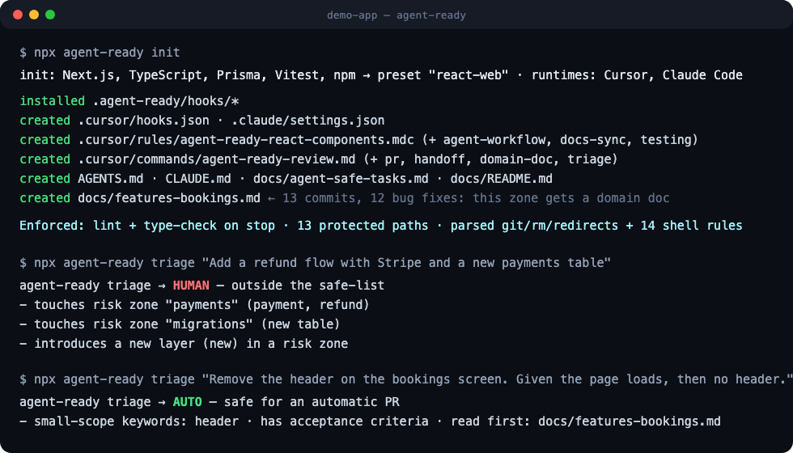
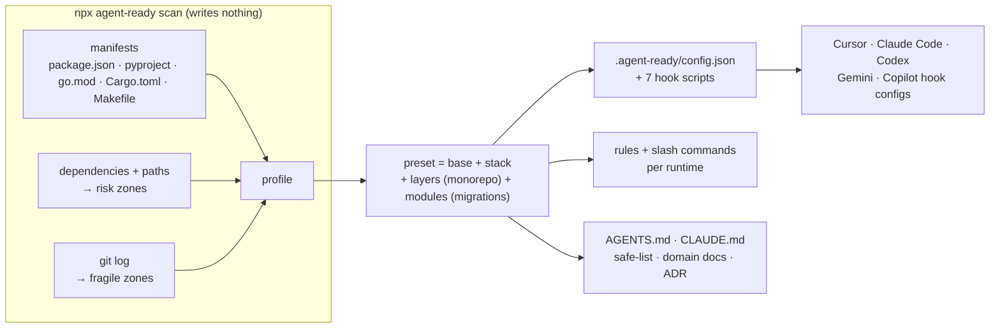

<h1 align="center">agent-ready</h1>

<p align="center"><strong>Hooks that deny, not prompts that hope.</strong><br>
One command turns any repository into a place where AI coding agents ship business logic — and cannot ship accidents.</p>

<p align="center">
  <a href="https://www.npmjs.com/package/agent-ready"></a>
  <a href="https://github.com/g0007b1/agent-ready/actions/workflows/ci.yml"></a>
  
  
  <a href="LICENSE"></a>
</p>

<p align="center"><code>npx agent-ready init</code></p>

<p align="center">
  <b>Cursor</b> · <b>Claude Code</b> · Codex · Gemini CLI · GitHub Copilot &nbsp;|&nbsp; Node · Python · Go · Rust · anything with a Makefile
</p>

<p align="center"></p>

> **"Remove the header on the bookings table screen."**
> Twenty minutes later there is a draft PR: lint green, types green, the diff self-reviewed against the team's rules, a test plan in the body, nothing touched outside the task. No "please don't edit the migrations" reminder. No babysitting.
> That is the bar this tool sets up — not by making the agent smarter, but by making the environment refuse to let it finish badly.

## The idea in one sentence

**A rule an agent can forget is not a rule.** Rules files live in the context window and lose to everything else in it; the agent edits `android/` twenty tool calls after reading "never edit `android/`". The only thing that reliably works is the runtime saying *no*: a pre-tool hook that returns **deny**, a stop hook that returns **not yet**. `agent-ready` packages that — hooks, layered docs, a safe-list, fragile-zone detection — into one idempotent, removable command for any stack.

## What you get in 60 seconds

```console
$ npx agent-ready init

agent-ready init: Next.js, TypeScript, TanStack Query, Prisma, Vitest, ESLint, npm → preset "react-web"; runtimes: Cursor, Claude Code

  installed    .agent-ready/hooks/*            7 dependency-free scripts, one implementation for every runtime
  created      .cursor/hooks.json  .claude/settings.json
  created      .cursor/rules/agent-ready-*.mdc  .claude/rules/agent-ready-*.md   (path-scoped conventions)
  created      .cursor/commands/agent-ready-*.md  .claude/commands/…             (/review /pr /handoff /domain-doc /triage)
  created      AGENTS.md  CLAUDE.md  docs/agent-safe-tasks.md  docs/README.md  docs/adr/  docs/handoffs/
  created      docs/features-bookings.md        ← 13 commits, 12 of them bug fixes: this zone gets a domain doc

Enforced: npm run lint && npm run type-check on stop; 13 protected path patterns; git/rm/sudo/redirect parsing + 14 shell rules.
```

```console
$ npx agent-ready doctor          # 60–90 checks against the real hook scripts, no agent needed

Guards (preset samples + bypass regressions):
  ok   write .env                                     deny
  ok   write prisma/migrations/001_init.sql           deny
  ok   shell: git push origin HEAD:main               deny      ← refspec parsed, not pattern-matched
  ok   shell: git push origin feature/main-page       allow     ← "main" inside a branch name is fine
  ok   shell: X=.env; echo S > $X                     deny      ← variables expanded, redirects resolved
  ok   shell: git commit -m "fix: sudo prompt"        allow     ← words inside quotes are not commands
  ok   write through a symlink to .env                deny
Session simulation:
  ok   stop-hook ran the checks itself after a code edit (green) and demands self-review
  ok   `npm run lint || true` does not count as green
  ok   SessionStart(compact) keeps the session state
Fail-closed on a broken config:
  ok   unparsable config denies every edit
```

```console
$ npx agent-ready triage "Add a refund flow with Stripe and a new payments table"
agent-ready triage → HUMAN — outside the safe-list
  - touches risk zone "payments" (payment, refund)
  - touches risk zone "migrations" (new table)
  - introduces a new layer (new) in a risk zone
```

## Before / after

| | Without | With `agent-ready` |
| --- | --- | --- |
| "Never touch the migrations" | A sentence in a prompt. Forgotten by tool call #23. | Denied at the edit tool **and** at the shell — `cp`, `tee`, `sed -i`, redirects, symlinks, `cd` chains, `$VAR` expansion. |
| Agent says "done" with red lint | The reviewer finds it. | The stop hook **runs the checks itself** and sends the agent back with the output. `\|\| true` does not count. |
| Agent "cleaned up" three unrelated files | An argument about scope in review. | Stop hook demands a self-review of **only the changed files** against the rules, no widening. |
| Sibling repo (`../backend`) gets edited | Someone notices in a week. | Read-only from edit tools and shell; the agent writes a **handoff** file instead. |
| `git push origin HEAD:main` | Slips past a regex. | `git push` is **parsed**: refspecs, `+ref`, `--mirror`, `--delete`, bare `push` on a protected branch. |
| "Which tasks can the bot take?" | Tribal knowledge. | `docs/agent-safe-tasks.md`, seeded from the risks the scanner actually found; `triage` gives a verdict. |
| Where does the agent keep breaking things? | You know. The agent doesn't. | Git churn → **domain docs** for the fragile zones, wired into the rules. |
| New teammate, new agent, new runtime | Explain it all again. | `AGENTS.md` for agents, `CLAUDE.md` for humans writing tasks, rules for the IDE, one hook set for five runtimes. |

## Runtimes

| Runtime | Hooks written to | Rules | Slash commands | Status |
| --- | --- | --- | --- | --- |
| **Cursor** | `.cursor/hooks.json` | `.cursor/rules/agent-ready-*.mdc` | `.cursor/commands/` | enforced, verified |
| **Claude Code** | `.claude/settings.json` | `.claude/rules/agent-ready-*.md` (path-scoped) | `.claude/commands/` | enforced, verified |
| **Codex CLI** | `.codex/hooks.json` | `docs/agent-rules/` linked from `AGENTS.md` | — | enforced, **experimental** |
| **Gemini CLI** | `.gemini/settings.json` | `docs/agent-rules/` | — | enforced, **experimental** |
| **GitHub Copilot** | `.github/hooks/agent-ready.json` | `.github/instructions/*.instructions.md` | — | enforced, **experimental** |

*Experimental* means wired from the vendor's published hook documentation (September 2026) and unit-tested against those payload shapes, but not yet verified in a live session. If you run one, `npx agent-ready doctor` plus a real "edit `.env`" attempt tells you in a minute — please open an issue either way. Windsurf and Kiro have hook APIs too and are on the roadmap.

One set of hook scripts serves every runtime; [`hooks/lib/protocol.js`](hooks/lib/protocol.js) is the only file that knows the wire formats. The runtime is passed as `--runtime` argv, so the generated commands also run in cmd / PowerShell.

## How it works



You never run these yourself. `init` copies seven small scripts into `.agent-ready/hooks/` and registers them with the runtime; from then on Cursor / Claude Code call them automatically at the right moments. They are listed here so you know what happens on your behalf:

| Hook (automatic) | Fires on | Does |
| --- | --- | --- |
| `session-start` | new session | Injects the gates as context. Resets state only for a genuinely new session — never on compaction or resume. |
| `guard-write` | edit tools | **Denies** protected paths, the hook machinery, sibling repos, anything outside the repo. Resolves symlinks. Parses Codex `apply_patch` text. Fail-closed. |
| `guard-read` | read tools | Secrets (`.env`, keys, credentials) never enter the agent context. `.env.example` does. |
| `guard-shell` | shell commands | Quote-aware parse of the command; every write target resolved against a virtual cwd; `git` / `rm` / `find` / `chmod` / privilege escalation recognised by command; `curl \| sh`; interpreter one-liners that mention protected paths → **ask**; reading secrets → **ask**. Then the preset's rules against the masked text. |
| `track-edit` | after an edit | Remembers changed files; invalidates green checks and the self-review; flags dependency / env / CI edits. |
| `track-checks` | after a shell command | Records honest check runs only: exit code when the runtime gives one, no `\|\| true`, not inside `echo` / `grep`. |
| `ensure-checks` | agent says "done" | The state machine below. **Runs the checks itself** for anything not green, bounded by a timeout. |

### The stop-hook

```
agent says "done"
  ├─ code edited → run every check not green since the last edit
  │      └─ any red → "these checks fail: <output>. Fix, rerun, then finish."
  ├─ diff not yet self-reviewed → "review ONLY these files against the rules; end with 'How to test'"
  ├─ dependency / env / CI file touched, docs not synced → "update README / AGENTS.md / .env.example — or say why not"
  └─ otherwise → released
```

Bounded by `maxStopAttempts` (default 4), so a broken toolchain cannot trap the agent. State is per session (`.agent-ready/state/<id>.json`), so two agents in one checkout do not release each other. Every deny / ask is appended to `.agent-ready/audit.log`.

## Stacks

Detected from the manifest — by evidence, so a Django app with a `package.json` for Tailwind stays Python. Override with `--preset`. Every preset extends a **base layer** (secrets, git safety, scope discipline, docs sync, testing); **layers** (monorepo) and **modules** (migrations, attached whenever an ORM is detected — a Next.js app with Prisma gets it too) stack on top.

| Preset | Detected from | Adds |
| --- | --- | --- |
| `node-api` | express / fastify / nest / koa / hono | backend-module rules; contracts and queues human-only |
| `react-web` | react / next / vite / vue / svelte / angular | component rules (one component per file, state placement, theme tokens) |
| `expo` | expo / react-native | `android/`, `ios/` protected; `eas build/submit/update`, `expo prebuild` ask; native-config rules |
| `node` | plain package.json | public-API discipline; publish / version bump guarded |
| `python` | pyproject / requirements / manage.py | `uv run` / `poetry run` prefixes; `pip install` without a lockfile asks; PyPI publish denied |
| `go` | go.mod | generated code (`*.pb.go`, `gen/`) protected; `go vet` / `go build` / `go test` gates |
| `rust` | Cargo.toml | `Cargo.lock` protected; `cargo publish` denied; clippy / check / test gates |
| `monorepo` (layer) | workspaces / turbo / nx / go.work / cargo workspace | one package per PR, shared packages human-only |
| `generic` | anything else | base layer + Makefile / justfile / Taskfile targets as gates |

Checks are whatever the repo already has: `npm run lint`, `uv run ruff check .`, `go vet ./...`, `cargo clippy`, `make lint`. If nothing is found, `scan` says exactly what to add and why.

## Commands and options

```
agent-ready init      [dir] [options]        Interactive setup — a wizard in a terminal, defaults with -y or in CI.
agent-ready refresh   [dir] [options]        Re-run with the answers you gave last time; flags override.
agent-ready scan      [dir] [--json]         Detect stack, checks, risk zones, fragile areas. Writes nothing.
agent-ready check     [dir] [--no-run]       Hooks wired? Checks runnable? Docs present? TODOs left?
agent-ready doctor    [dir] [--verbose]      Run every guard against samples and bypass regressions; simulate a session.
agent-ready triage    "<task>" [--json]      auto / needs-ac / human — exit code 0 / 2 / 3, for bots and CI.
agent-ready config    get [key] | set <key> <value>   Change any knob; hooks pick it up on the next call.
agent-ready runtimes | presets               What is detected here; which stacks are known.
agent-ready skill     [dir] [--to <path>]    Install the agent-ready skill so an agent can finish the setup.
agent-ready uninstall [dir] [--docs]         Exact inverse of init.
```

Nothing is installed that you did not pick. The wizard asks six things — stack preset, **which runtimes** (only the detected ones are pre-selected), strictness profile, components, read-only neighbours, base branch / prefix — and `refresh` remembers the answers. Every question has a flag for scripts and CI:

| Flag | Meaning |
| --- | --- |
| `-y` / `--dry-run` / `-i` | no questions · show what would be written · force the wizard (also for `refresh`) |
| `--runtime cursor,claude` | which agent runtimes get hooks, rules and commands (repeatable) |
| `--profile strict\|balanced\|light` | a coherent bundle of knobs — see below |
| `--only hooks,docs` / `--skip commands` | components: `hooks`, `rules`, `commands`, `docs`, `domain-docs`, `templates`, `skill` |
| `--no-review` / `--no-docs-sync` | switch the two stop-hook nudges off individually |
| `--check "<cmd>"` (repeatable) | use these as the gates instead of the detected lint / type-check |
| `--require-tests` | also gate on the detected test command |
| `--protected-branches release,trunk` | branches an agent may never push to directly (base branch is always included) |
| `--siblings ../backend` | neighbouring repos that agents may read but never write |
| `--preset`, `--base-branch`, `--branch-prefix`, `--force` | override detection; overwrite docs without markers |

| Profile | Stop hook | Gates | `rm -r` | reading `.env` | `node -e` / `python -c` touching protected paths |
| --- | --- | --- | --- | --- | --- |
| **strict** | re-runs **every** check, tests required, 6 attempts | review + docs-sync | deny | deny | deny |
| **balanced** (default) | re-runs checks not honestly green, 4 attempts | review + docs-sync | ask | ask | ask |
| **light** | same, 2 attempts | none — checks only | allow (root / home / `..` still deny) | ask | ask |

Any single knob can be changed afterwards without re-running init:

```bash
npx agent-ready config set strictness.rmRecursive deny
npx agent-ready config set gates.review false
npx agent-ready config set runChecksOnStop always
```

## What gets generated

```
.agent-ready/
  config.json        protected paths, shell rules, checks, siblings, protected branches — read on every hook call
  hooks/             seven scripts + lib; runtime-agnostic
  state/ audit.log profile.json               (gitignored)
.cursor/hooks.json  .cursor/rules/  .cursor/commands/          .claude/settings.json  .claude/rules/  .claude/commands/
.codex/hooks.json   .gemini/settings.json   .github/hooks/     (when those runtimes are selected)
AGENTS.md            operating manual for agents: task intake, gates, hard bans, PR ritual (managed block + your notes)
CLAUDE.md            product context for humans writing tasks: vocabulary, task shape, what breaks a PR (imports AGENTS.md)
docs/README.md · docs/agent-safe-tasks.md · docs/handoffs/_TEMPLATE.md · docs/adr/_TEMPLATE.md
docs/<fragile-zone>.md       one per high-churn area — and nowhere else; empty docs are noise
```

Everything is namespaced (`.agent-ready/`, `agent-ready-*`), merged (your other hooks survive; an unparsable settings file is never overwritten), or inside `<!-- agent-ready:managed -->` markers. Text around the markers survives `refresh`; `uninstall` removes exactly what was installed.

| Slash command | What it makes the agent do |
| --- | --- |
| `/agent-ready-review` | Review the branch vs base against rules, domain docs and safe-list; run the checks; verdict. |
| `/agent-ready-pr` | Checks → commit → push → **draft** PR with Summary + Test plan, exactly as `AGENTS.md` says. |
| `/agent-ready-handoff` | The spec disagrees with a sibling repo: write the handoff file, don't work around it. |
| `/agent-ready-domain-doc <dir>` | Fill a fragile-zone doc from git history, tests and types — no guessing. |
| `/agent-ready-triage <task>` | Decide auto / human before touching code. |

## Let the agent finish the setup

The generator does the deterministic part. The judgement part — what the product is, its vocabulary, what actually breaks in each fragile zone — lives in the code and the git history, and an agent is good at reading those.

```bash
npx agent-ready skill        # copies skill/agent-ready into .agents/skills (or .claude/skills)
```

> "Finish the agent-ready setup for this repository using the agent-ready skill."

The skill scans, asks at most five questions, fills `CLAUDE.md` and the domain docs from real sources, tunes the safe-list, runs `doctor`, and ends by performing one trivial task to prove the stop hook actually stopped it.

## Customising

Everything is data in `.agent-ready/config.json`, read on every hook call — no restart:

```jsonc
{
  "checks": [{ "id": "lint", "command": "npm run lint" }, { "id": "typeCheck", "command": "npm run type-check" }],
  "runChecksOnStop": "missing",            // missing | always | never — "always" re-runs even when the agent reported green
  "denyWrite": [{ "source": "^infra/", "flags": "", "label": "infrastructure" }],
  "denyShell": [{ "source": "^terraform\\s+apply", "flags": "", "why": "infra is human-only", "severity": "deny" }],
  "protectedBranches": ["main", "release"],
  "siblings": ["../backend"],
  "maxStopAttempts": 4
}
```

Add a ban, run `npx agent-ready doctor`, mention it in `AGENTS.md`. Presets are plain data files under [`presets/`](presets/) — a new stack is one `preset.js` plus a rules file, with `doctor` samples that must deny and must not.

## Compared with…

| | Config sync ([ruler](https://github.com/intellectronica/ruler), [rulesync](https://github.com/dyoshikawa/rulesync)) | Safety hooks ([cc-safety-net](https://github.com/kenryu42/cc-safety-net), [hookify](https://github.com/anthropics/claude-plugins-official)) | Readiness scoring ([agentready](https://github.com/ambient-code/agentready)) | **agent-ready** |
| --- | --- | --- | --- | --- |
| Rules / AGENTS.md across runtimes | ✅ | — | — | ✅ generated from the scan |
| Deny destructive shell commands | — | ✅ regex / rulebooks | — | ✅ parsed (`git push` refspecs, `rm` targets, `cd` chains, `$VAR`) |
| Deny writes to protected paths — from the shell too | — | partial | — | ✅ every write target resolved and classified |
| Stop hook: checks must be green, self-review, docs sync | — | — | — | ✅ runs the checks itself |
| Risk zones + safe-list from the repo's own dependencies | — | — | ✅ scores | ✅ enforced + `triage` |
| Fragile zones from git history → domain docs | — | — | — | ✅ |
| Zero dependencies, `uninstall` is exact | varies | ✅ | — | ✅ |

Good tools, different jobs; several are worth using alongside. This one exists because nobody combined the stop-gate, the scan-derived bans and the docs layer in a single command.

## Design decisions

Each one is an ADR in [`docs/adr/`](docs/adr/) — the same template the tool installs for you.

- **Enforce in the runtime, not in the prompt.** Rules that matter are hooks; the rest is labelled convention. [ADR-0001](docs/adr/0001-enforce-in-runtime-not-prompt.md)
- **Fail closed for writes, bounded for stops.** Unknown edit target or unreadable config → deny. Stop attempts are capped so nothing loops forever. [ADR-0002](docs/adr/0002-fail-closed-writes-bounded-stops.md)
- **One hook implementation, adapters per runtime.** Wire formats live in one file. [ADR-0003](docs/adr/0003-one-hook-implementation-many-runtimes.md)
- **Zero runtime dependencies.** Hooks run on every tool call and must never break on `npm install`. [ADR-0004](docs/adr/0004-zero-dependencies.md)
- **Triage is deterministic, not an LLM call.** Reproducible, explainable, scriptable. [ADR-0005](docs/adr/0005-deterministic-triage.md)
- **Managed blocks and namespacing.** Re-runnable, removable, never clobbers your text. [ADR-0006](docs/adr/0006-managed-blocks-and-namespacing.md)

## How it is tested

`npm test` builds five throwaway repositories (Expo + a sibling backend, Python with a tooling `package.json`, Next.js + Prisma, a Go workspace, a Makefile-only repo), runs every command against them and drives the real hook scripts with the payloads each runtime sends. Every bypass found in review is a regression case — `git push origin HEAD:main`, `X=.env; echo S > $X`, `tee .env`, symlinks, `|| true`, a spoofed state file, a corrupted config, compaction mid-task. No framework, no mocks; CI runs it on Linux, macOS and Windows for Node 18 / 20 / 22, then installs the tool into its own repository and runs `doctor` on it.

## Limitations — read before trusting it

- The shell guard understands commands, not intent. It parses quotes, heredocs, `cd` chains, `$VAR`, redirects, `git` and `rm` semantics, and asks on interpreter one-liners that mention protected paths. It does **not** execute the command in a sandbox. A determined agent with shell access can still cause harm — which is why the safe-list and human review remain part of the design, and why "human-only" zones like payments and auth are conventions reviewed by people, not hooks.
- Cursor honours `ask` on shell commands but not on edit tools; Gemini CLI has no `ask`, so asks become denies with a reason.
- Codex, Gemini and Copilot adapters are experimental (see Runtimes).
- `triage` is keyword-based by design; it is a pre-filter, not a judge.
- Node ≥ 18 is required in every repo, including Python / Go / Rust ones, because the hooks are Node scripts. `npx` implies it.

## Where this comes from

Extracted from a production team running a React Native app, a Node.js API and a Telegram bot that opens pull requests through an agent SDK. Over a year, the practices that survived were the same regardless of stack: enforce in the runtime, one document per audience, a safe-list by blast radius, domain docs only where things break, sibling repos read-only, draft PRs with a test plan. The longer version is in [docs/why.md](docs/why.md).

Built by [Dmitry Izgagin](https://github.com/g0007b1). If you run agents against real codebases and want to compare notes — issues and discussions are open.

## Roadmap

- Live verification of the Codex / Gemini / Copilot adapters; Windsurf and Kiro adapters.
- `agent-ready prove`: run a canary task through the real runtime and assert the hooks fired.
- Risk scoring from the diff as a PR check, using the same signals as `triage`.
- JVM / Ruby / PHP / Elixir presets — one data file each, good first issues.

## Contributing

See [CONTRIBUTING.md](CONTRIBUTING.md), [docs/architecture.md](docs/architecture.md) and [docs/hooks.md](docs/hooks.md). Found a way around a guard? [SECURITY.md](SECURITY.md).

<p align="center"><a href="https://star-history.com/#g0007b1/agent-ready&Date"></a></p>

MIT
